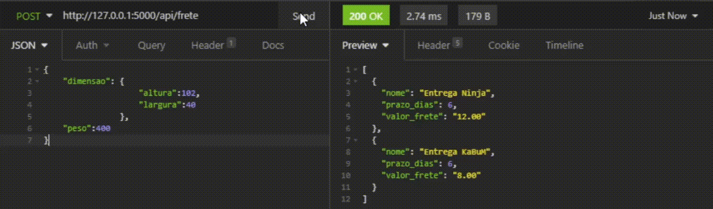

# API REST - LISTA DE FRETES KaBuM
<div style="text-align:center">
    
</div>

# SOBRE

Esta API foi desenvolvida na linguagem Python utilizando o framework Flask onde é possível realizar consultas nos valores de frete através do envio de requisições utilizando do método POST

# EXEMPLO
No exemplo abaixo mostra o envio das informações em formato JSON sendo enviadas para a API através da URL :
```url
 http://127.0.0.1:5000/api/frete 
 ```


<div style="text-align:center">
    
</div>

# ARQUITETURA
Para facilitar o entendimento e funcionamento do código foi criada o diretório ``api`` dentro de ``controllers`` responsável por carregar os arquivos  ``api_frete.py`` e ``calculo.py``  responsável pela regra de negócio da API

O único ``__init__.py ``que temos fica responsável em carregar os módulos com Flask e Cors e chamar os controllers necessário para funcionamento da API.

```python
from flask import *
from flask_cors import CORS, cross_origin


# ------------------------------ FLASK ---------------------------------
app = Flask(__name__)  
# ------------------------ CONFIGURAÇÂO CORS API ------------------------------
CORS(app, resources={r"/*": {"origins": "*"}})


# ---------------------------CHAMADA DOS CONTROLLERS------------------------------
from app.controllers.api import api_frete
```
Para evitar erros o CORS está configurado para aceitar requisições de qualquer origem, isso deve ser alterado no deploy da aplicação!

E por fim temos o arquivo ``app.py`` responsável por rodar o servidor com debug ativo utilizando a porta 5000

```python
from app import app

if __name__ == '__main__':
  app.run(debug=True,host='127.0.0.1', port=5000)
  ```

  Obs: O diretório static é apenas para carregar as imagens utilizada neste ``README.md``

# REGRA DE NEGÓCIO

Toda a regra de negócio foi desenvolvida no arquivo ``calculo.py`` seguindo o conceito de orientação a objeto, as informações enviadas pela rota da API são coletadas através de uma função localizada no arquivo ``api_frete.py`` enviadas para o objeto que retorna o resultado em formato JSON

``api_frete.py``
```python
@app.route("/api/frete", methods=['POST'])
def api_frete():

  # COLEÇÂO DE DADOS
  data = request.get_json()

  dimensao = data['dimensao']
  altura = dimensao['altura']
  largura = dimensao['largura']
  peso = data['peso']

  resultado = Calculo_frete(altura,largura,peso).frete()

  return (resultado)
  ```

  ``calculo.py``

  ```python
class Calculo_frete:


  def __init__(self,altura,largura,peso):

    self.altura = altura
    self.largura = largura
    self.peso = peso

  def fretes(self):
# --------------------------------LISTA DE FRETES------------------------------------
    frete_list = []
# -----------------------------------Ninja-------------------------------------------
    if((self.altura >= 10) and 
      (self.altura <= 200) and 
      (self.largura >= 6) and 
      (self.largura <= 140) and 
      (self.peso > 0)):
      
      frete_list.append ({
        "nome":"Entrega Ninja",
    	  "valor_frete": format((self.peso * 0.3)/(10), '.2f'),
    	  "prazo_dias": 6
	      })

    else:
      pass
# ---------------------------------KaBuM---------------------------------------------
    if((self.altura >= 5) and 
      (self.altura <= 140) and 
      (self.largura >= 13) and 
      (self.largura <= 125) and 
      (self.peso > 0)):
      
      frete_list.append ({
        "nome":"Entrega KaBuM",
    	  "valor_frete": format((self.peso * 0.2)/(10), '.2f'),
    	  "prazo_dias": 6
	      })

    else:
      pass
      
    return jsonify(frete_list)

  def frete(self):

    return self.fretes()

```

Objeto atende as seguintes especificações e exigencias:
- Entrega Ninja:
    - Constante para cálculo do frete: 0.3
    - Altura mínima: 10 cm
    - Altura máxima: 200 cm
    - Largura mínima: 6 cm
    - Largura máxima: 140 cm
    - Prazo para entrega: 6 dias

- Entrega KaBuM:
    - Constante para cálculo do frete: 0.2
    - Altura mínima: 5 cm
    - Altura máxima: 140 cm
    - Largura mínima: 13 cm
    - Largura máxima: 125 cm
    - Prazo para entrega: 4 dias

Caso alguma validação não seja atendida o output não irá retornar resultado conforme o exemplo abaixo:

### output

```json
[]
```

